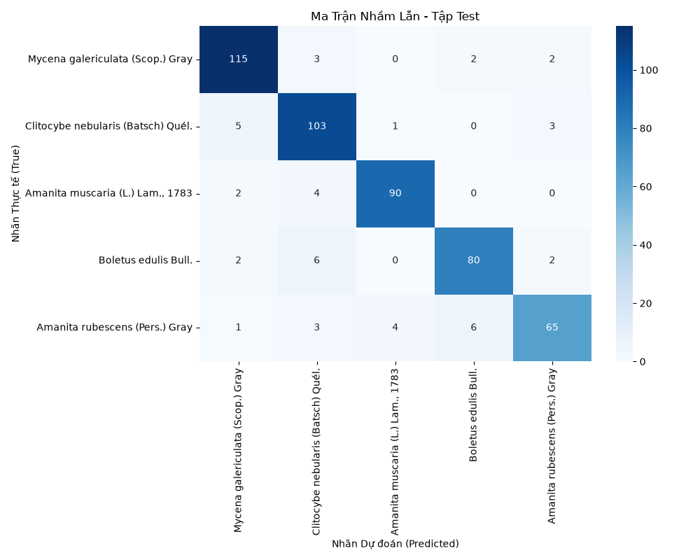

# Hệ thống phân loại nấm (Fungi Classification - DF20-Mini)

Ứng dụng web nhận diện và phân loại nấm theo tên loài, chi và họ dựa trên kỹ thuật Transfer Learning với tập dữ liệu ảnh DF20-Mini, tích hợp giao diện tương tác Gradio.

---

## 📁 Cấu trúc thư mục chính

```text
fungi-classification-df20m/
├── models/                  # Chứa file trọng số mô hình (.pth)
│   └── best_model.pth
├── results/                 # Kết quả đánh giá và ma trận nhầm lẫn
│   └── figures/
├── scripts/                 # Mã nguồn tiền xử lý, huấn luyện và đánh giá
│   ├── prepare_data.py
│   ├── train.py
│   └── evaluate.py
├── web/                     # Mã nguồn giao diện Gradio
│   └── app.py
├── requirements.txt         # Danh sách các thư viện phụ thuộc
└── README.md
```

---

## 🚀 Hướng dẫn cài đặt và chạy ứng dụng

### 1. Clone mã nguồn về máy
```bash
git clone https://github.com/johnluong31/fungi-classification-df20m.git
cd fungi-classification-df20m
```

### 2. Thiết lập môi trường ảo

**Sử dụng Conda:**
```bash
conda create -n fungi-df20 python=3.11 -y
conda activate fungi-df20
```

*Hoặc sử dụng Python `venv`:*
```bash
# Windows
python -m venv venv
venv\Scripts\activate

# Linux / macOS
python3 -m venv venv
source venv/bin/activate
```

### 3. Cài đặt các thư viện phụ thuộc
```bash
pip install -r requirements.txt
```

### 4. Khởi chạy ứng dụng Web (Gradio)
```bash
python web/app.py
```

Sau khi khởi chạy thành công, mở trình duyệt web và truy cập vào địa chỉ:
```text
http://127.0.0.1:7860
```

---

## 📊 Kết quả đánh giá mô hình


